# CYBERGUARD

**Local-First AI Cybersecurity Threat, Phishing & Impersonation Detection**

`Cybersecurity` · `AI/ML` · `FastAPI` · `Laya` · `Qwen 3` · `PostgreSQL` · `Redis`

CYBERGUARD is a local-first cybersecurity platform combining deterministic heuristics with local neural models (**Laya** and **Qwen 3**) to deliver explainable, high-speed security assessments for URLs, emails, and suspicious content with zero mandatory cloud dependencies.

---

## Architecture

```mermaid
%% Generated by https://gitdiagram.com/ombharati/cyberguard
flowchart TD

subgraph group_entry["User Entry"]
  node_frontend["Web Dashboard<br/>[script.js]"]
  node_api["FastAPI Application<br/>[main.py]"]
  node_v1api["Scan API<br/>[scans.py]"]
  node_compatapi["Compatibility API<br/>[frontend_compat.py]"]
  node_schemas["Request Schemas<br/>[scan.py]"]
end

subgraph group_lifecycle["Scan Lifecycle"]
  node_service["Scan Service<br/>[scan_service.py]"]
  node_queue["Redis Job Queue<br/>[queue.py]"]
  node_worker["Background Worker<br/>[worker.py]"]
  node_orchestrator["Scan Orchestrator<br/>[orchestrator.py]"]
end

subgraph group_analysis["Threat Analysis"]
  node_url["URL Heuristics<br/>[detector.py]"]
  node_ssrf["SSRF Validation<br/>[ssrf.py]"]
  node_emailparser["Email Parser<br/>[parser.py]"]
  node_emailheuristics["Email Heuristics<br/>[heuristics.py]"]
  node_risk["Risk Engine<br/>[risk_engine.py]"]
  node_intel["External Threat Intel<br/>[external_intel.py]"]
end

subgraph group_persistence["Storage and Config"]
  node_config["Runtime Settings<br/>[config.py]"]
  node_database["Database Sessions<br/>[database.py]"]
  node_models[("Scan Records<br/>[scan.py]")]
end

subgraph group_integrations["Model Integrations"]
  node_laya["Laya Adapter<br/>[laya_adapter.py]"]
  node_qwen["Qwen Adapter<br/>[qwen_adapter.py]"]
end

node_user(("User / Browser"))
node_ollama["Ollama Service"]
node_postgres[("PostgreSQL")]
node_redis[("Redis")]

node_user -->|"uses"| node_frontend
node_frontend -->|"sends HTTP scans"| node_api
node_api -->|"routes requests"| node_v1api
node_api -->|"routes requests"| node_compatapi
node_api -->|"serves assets"| node_frontend
node_v1api -->|"validates and responds"| node_schemas
node_v1api -->|"delegates scans"| node_service
node_compatapi -->|"validates and responds"| node_schemas
node_compatapi -->|"delegates scans"| node_service
node_service -->|"creates scan"| node_models
node_service -->|"executes synchronously"| node_orchestrator
node_service -->|"enqueues scan"| node_queue
node_worker -->|"dequeues scan"| node_queue
node_worker -->|"executes scan"| node_orchestrator
node_orchestrator -->|"analyzes URLs"| node_url
node_url -->|"validates host"| node_ssrf
node_orchestrator -->|"parses email"| node_emailparser
node_orchestrator -->|"checks email"| node_emailheuristics
node_emailheuristics -->|"uses parsed email"| node_emailparser
node_orchestrator -->|"scores URLs"| node_laya
node_orchestrator -->|"analyzes content"| node_qwen
node_orchestrator -.->|"queries intelligence"| node_intel
node_orchestrator -->|"calculates risk"| node_risk
node_orchestrator -->|"persists findings"| node_models
node_qwen -->|"requests inference"| node_ollama
node_api -->|"loads settings"| node_config
node_api -->|"checks database"| node_database
node_database -->|"configures connection"| node_config
node_models -->|"uses ORM base"| node_database
node_database -->|"connects to"| node_postgres
node_queue -->|"stores jobs"| node_redis
node_api -->|"checks availability"| node_queue

click node_frontend "https://github.com/ombharati/cyberguard/blob/main/app/frontend/script.js"
click node_api "https://github.com/ombharati/cyberguard/blob/main/app/backend/main.py"
click node_v1api "https://github.com/ombharati/cyberguard/blob/main/app/backend/api/v1/scans.py"
click node_compatapi "https://github.com/ombharati/cyberguard/blob/main/app/backend/api/frontend_compat.py"
click node_schemas "https://github.com/ombharati/cyberguard/blob/main/app/backend/schemas/scan.py"
click node_service "https://github.com/ombharati/cyberguard/blob/main/app/backend/services/scan_service.py"
click node_queue "https://github.com/ombharati/cyberguard/blob/main/app/backend/services/queue.py"
click node_worker "https://github.com/ombharati/cyberguard/blob/main/app/backend/services/worker.py"
click node_orchestrator "https://github.com/ombharati/cyberguard/blob/main/app/backend/services/orchestrator.py"
click node_url "https://github.com/ombharati/cyberguard/blob/main/detection/url/detector.py"
click node_ssrf "https://github.com/ombharati/cyberguard/blob/main/detection/url/ssrf.py"
click node_emailparser "https://github.com/ombharati/cyberguard/blob/main/detection/email/parser.py"
click node_emailheuristics "https://github.com/ombharati/cyberguard/blob/main/detection/email/heuristics.py"
click node_risk "https://github.com/ombharati/cyberguard/blob/main/app/backend/services/risk_engine.py"
click node_intel "https://github.com/ombharati/cyberguard/blob/main/app/backend/services/external_intel.py"
click node_laya "https://github.com/ombharati/cyberguard/blob/main/app/backend/services/ai/laya_adapter.py"
click node_qwen "https://github.com/ombharati/cyberguard/blob/main/app/backend/services/ai/qwen_adapter.py"
click node_config "https://github.com/ombharati/cyberguard/blob/main/app/backend/core/config.py"
click node_database "https://github.com/ombharati/cyberguard/blob/main/app/backend/core/database.py"
click node_models "https://github.com/ombharati/cyberguard/blob/main/app/backend/models/scan.py"

classDef toneNeutral fill:#f8fafc,stroke:#334155,stroke-width:1.5px,color:#0f172a
classDef toneBlue fill:#dbeafe,stroke:#2563eb,stroke-width:1.5px,color:#172554
classDef toneAmber fill:#fef3c7,stroke:#d97706,stroke-width:1.5px,color:#78350f
classDef toneMint fill:#dcfce7,stroke:#16a34a,stroke-width:1.5px,color:#14532d
classDef toneRose fill:#ffe4e6,stroke:#e11d48,stroke-width:1.5px,color:#881337
classDef toneIndigo fill:#e0e7ff,stroke:#4f46e5,stroke-width:1.5px,color:#312e81
classDef toneTeal fill:#ccfbf1,stroke:#0f766e,stroke-width:1.5px,color:#134e4a
class node_frontend,node_api,node_v1api,node_compatapi,node_schemas,node_user toneBlue
class node_service,node_queue,node_worker,node_orchestrator,node_postgres,node_redis toneAmber
class node_url,node_ssrf,node_emailparser,node_emailheuristics,node_risk,node_intel toneMint
class node_config,node_database,node_models toneRose
class node_laya,node_qwen,node_ollama toneIndigo
```



---

## AI Responsibilities & Hardware Strategy

Designed specifically for resource-conscious local execution (tested on RTX 3050 Laptop GPU 6 GB VRAM, 16 GB RAM):

| Model | Role | Runtime & Device | Purpose |
|---|---|---|---|
| **Laya** | URL Decision Model | **CPU** (`torch` / ModernBERT) | Fast System 1 calibrated probability classifier (~80ms). Never receives entire emails. |
| **Qwen 3 (8B)** | Semantic Analysis | **GPU** (Ollama `qwen3:8b`) | Deep System 2 contextual reasoning, urgency assessment, and explanation generation. |
| **Risk Engine** | Final Scoring | **Pure Deterministic Logic** | Synthesizes signals into an explainable 0–100 score. Never makes I/O or model calls. |

---

## Quickstart

> 🚀 **Quick Start**: Run `./scripts/start_server.sh` to automatically launch PostgreSQL, Redis, local AI models, FastAPI, the worker queue, and the public HTTPS tunnel.
>
> 🌐 **Live Web App**: [ombharati.github.io/CYBERGUARD](https://ombharati.github.io/CYBERGUARD/)  
> ⚡ **Live Server Subdomain**: [ali-caps-prostores-derby.trycloudflare.com](https://ali-caps-prostores-derby.trycloudflare.com)

### 1. Prerequisites
- Python 3.11+
- Docker & Docker Compose (for PostgreSQL and Redis)
- Ollama with `qwen3:8b` installed (`ollama run qwen3:8b`)

### 2. Start PostgreSQL & Redis
```bash
docker compose up -d postgres redis
```

### 3. Run Backend & Frontend Locally
```bash
# Setup virtual environment and dependencies
uv venv .venv
source .venv/bin/activate
uv pip install -r requirements.txt

# Run database migrations
alembic upgrade head

# Start API server (serves frontend at http://localhost:8000)
python main.py
```

### 4. Run the Background Queue Worker (Optional for Async Queue)
```bash
python -m app.backend.services.worker
```

Open `http://localhost:8000` in your browser to interact with the CYBERGUARD dashboard.

---

## Automated Test Suite

CYBERGUARD includes 36 automated tests covering API validation, deterministic URL detection, SSRF protection, email parsing, AI adapters, risk scoring, queue fallback, and live integration:

```bash
# Run unit and API tests (fast)
pytest -k "not test_live_integration"

# Run complete test suite including live model integration
pytest
```

---

## API Endpoints

- `GET /health` — System status (Database, Redis, Ollama, Laya)
- `POST /api/v1/scans` — Queue a scan asynchronously (`?sync=true` for immediate result)
- `GET /api/v1/scans/{scan_id}` — Retrieve scan status and complete findings
- `GET /api/v1/scans` — List scan history
- `POST /api/scans` — Frontend compatibility endpoint (synchronous execution)
- `GET /api/scans` — Frontend scan history endpoint
- `GET /` — Serves the frontend user interface directly

---

## Documentation

For in-depth technical guides, explore the dedicated documentation in [`docs/`](./docs/):

- [Architecture & Pipeline](./docs/architecture.md) — Layered design, scan lifecycle, and component boundaries.
- [System Requirements & Specifications](./docs/requirements.md) — Hardware budgets, functional requirements, and latency SLAs.
- [API Reference](./docs/api.md) — REST endpoints, payload schemas, status codes, and cURL examples.
- [Database & Schema](./docs/database.md) — PostgreSQL table definitions, indexing strategy, and Alembic migrations.
- [Security & Threat Model](./docs/security.md) — Pre-flight SSRF protection, prompt injection defense, and input limits.
- [Deployment & Operations](./docs/deployment.md) — Native tunnel, Docker Compose, and GitHub Pages hybrid setup.
- [Developer Guide](./docs/development.md) — Local environment setup, test suites, and contribution workflow.

